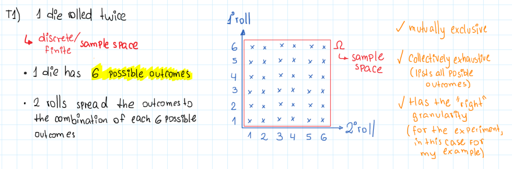
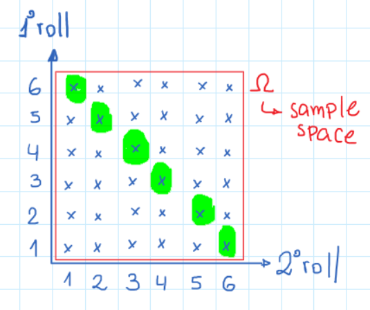

#### Probability Models and Axioms


#### Define the sample space for rolling a six-sided die twice.



#### Explain the three axioms of probability and give an example of each one.

The three axioms of probability are the following ones:

1. **Nonnegativity**:  
   Probability can't be negative, so any probability $P(A)$ would be greater or equal to zero: $P(A) \geq 0$.  
   Example: When rolling a die, the probability of rolling any number (e.g., $P(1)$) is at least 0 and cannot be negative.

2. **Normalization**:  
   The sum of the probabilities in the sample space is equal to one: $P(\Omega) = 1$.  
   Example: For a fair six-sided die, the probabilities of rolling any number add up to 1 becuase theoretically each side has a probability of $1/6$:  
   $P(1) + P(2) + P(3) + P(4) + P(5) + P(6) = 1$.

3. **Additivity (For finite sample spaces)**:  
   In a discrete sample space, if $A \cap B = \emptyset$, then $P(A \cup B) = P(A) + P(B)$.  
   **Example**: When flipping a fair coin, the probability of getting heads ($A$) or tails ($B$) is:  
   $P(A \cup B) = P(\text{Heads}) + P(\text{Tails}) = 0.5 + 0.5 = 1$.


#### Calculate the probability of rolling a sum of 7 when rolling two six-sided dice.

If we define the sample space of a two roll experiment, it look like this:



So, if any combination has a probability of $P(x_i, y_i) = 1/32$ and this is a discrete sample space we can use the additivity axiom which says that if we are in a finite sample and $P(A) \cap P(B) = \emptyset$ we can sum up these probabilities where $P(A \cup B) = P(A) + P(B)$.

In this we have a set of $x, y$ discrete outcomes, then the intersection of two of them $P(x_i,  y_i) \cap P(x_j, y_j) = \emptyset \wedge i \neq j$. Because of that we can add up the probability of the six combinations that sum up seven.

So, let's compute the probability:

```math
P(x_i + y_i = 7) = P(1, 6) + P(2, 5) + P(3, 4) + P(4, 3)+ P(5, 2) + P(6, 1) \\
P(x_i + y_i = 7) = 1/32 + 1/32 + 1/32 + 1/32 + 1/32 + 1/32 \\
P(x_i + y_i = 7) = 6/32 = 1/6 \\
P(x_i + y_i = 7) \approx 0.167 \\
```

#### Define a continuous sample space for a point chosen uniformly at random in a square with side length 1.

#### If $A$ and $B$ are two events such that $P(A) = 0.3$, $P(B) = 0.4$, and $P(A \cap B) = 0.1$, find $P(A \cup B)$.

#### Describe the countable additivity property and provide a simple example where it applies.

#### If $P(A) = 0.6$, calculate $P(A^c)$.

#### Explain what it means for two events to be mutually exclusive and provide an example.

#### State and explain the law of total probability using an example.

#### Discuss the difference between the frequentist and Bayesian interpretations of probability.

---

#### A bag contains 3 red, 2 blue, and 5 green balls. What is the probability of picking a red or a green ball?

#### Roll a six-sided die twice. What is the probability of rolling a 4 on the first roll and an even number on the second roll?

#### What is the probability of drawing an Ace or a King from a standard 52-card deck?

#### A random variable $X$ is uniformly distributed over $[0, 1]$. What is the probability that $X < 0.25$?

#### Toss a fair coin three times. What is the probability of getting exactly two heads?

#### Given that a six-sided die roll resulted in an even number, what is the probability it was a 4?

#### A jar contains 4 red and 6 blue balls. Two balls are picked randomly without replacement. What is the probability that both are red?

#### Roll a tetrahedral die twice. What is the probability that the sum of the two rolls is at most 5?

#### For a discrete random variable with outcomes $x = \lbrace 1, 2, 3 \rbrace$ and probabilities $P(1) = 0.2$, $P(2) = 0.5$, $P(3) = 0.3$, verify that it satisfies the axioms of probability.

#### The probability of rain tomorrow is $0.7$. What is the probability it will not rain?
